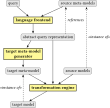

# Implementation

## Structure

The following diagram shows the main components of NeoJoin (yellow boxes) and their inputs and outputs (grey boxes).

The **language frontend** parses the given query and together with the referenced source meta-models generates and abstract representation of the query (AQR). The **target meta-model generator** uses the AQR to generate an Ecore meta-model for the view. The **transformation engine** transforms source instance-models into an instance of the view using the AQR and the view's meta-model.

#### Frontend/Language

* [Xtext grammar for NeoJoin](/lang/frontend/src/main/xtext/tools/vitruv/neojoin/NeoJoin.xtext) ([Xtext grammar reference](https://eclipse.dev/Xtext/documentation/301_grammarlanguage.html))
* `aqr` - AQR generation. Xtext provides an abstract representation of the input query file. The `AQRBuilder` performs various normalizations to generate the AQR from Xtext's query representation. These normalizations include:
    * inferring feature types based on the given expressions
    * transformation subqueries into top-level queries
    * generating queries for classes which are referenced but not explicitly generated from a query
    * populating query target classes with features when no body was provided (e.g. `from Food create`)
* `collector` - collecting input models (meta or instance) from a given search path
* `generation` - target meta-model generation from AQR
* `jvmmodel` - Xtend expressions (= Xbase) work on java classes.
    * To allow for expressions to reference classes and attributes of Ecore models, the `SourceModelInferrer` generates java representations of the input Ecore models.
    * In order to use the type checking that is provided by Xtext, we need to tell Xtext what local variables are in scope of each expression. This is done in the `QueryModelInferrer` which creates a method for each expression and defines local variables as parameters.
* `scoping` - provides scoping information, e.g. meta-models available for import, classes that can be referenced in queries
* `validation` - custom validation rules for queries that cannot be expressed as part of the grammar, e.g. duplicated names
